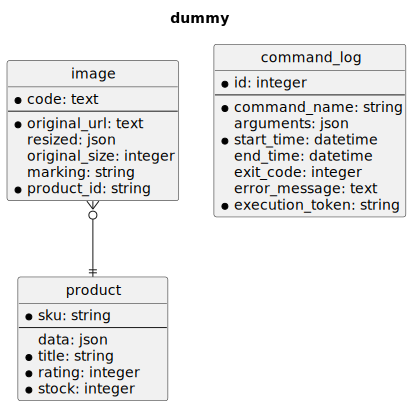

# survos-sites/dummy

## Installation

```bash
git clone git@github.com:survos-sites/dummy dummy && cd dummy
echo "DATABASE_URL=sqlite:///%kernel.project_dir%/var/data.db" > .env.local
echo "DATABASE_URL=sqlite:///%kernel.project_dir%/var/data_test.db" > .env.test
composer install
make -p data
curl "https://dummyjson.com/products?limit=200" -o data/products.json
bin/console doctrine:schema:update --force

bin/console app:load
bin/console meili:index
symfony proxy:domain:attach dummy
symfony server:start -d
symfony open:local --path=/meili
```


## Database




Steps:

* Load the dummy data via fixtures
* iterate through the images marked as 'new' and dispatch a request to sais
* sais calls a webhook when the image has been resize
* the webhook update the Image record with the resized data and applies a transition

```bash
bin/console app:load
bin/console workflow:iterate App\\Entity\\Image  --marking=new --transition=dispatch -vvv --limit 3
symfony open:local --path=/images
```

## Running tests

```bash
bin/console doctrine:schema:update --force --env=test
bin/console doctrine:fixtures:load -n --env=test
vendor/bin/phpunit
```


    usage here.


Someday translations, but removed on April 12, 2025.


*build with survos/doc-bundle*
