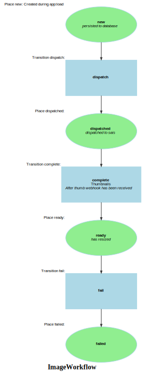

Markdown for ImageWorkflow




---
## Transition: dispatch

### dispatch.Transition

        onTransitionDispatch()
        // 
```php
#[AsTransitionListener(self::WORKFLOW_NAME, IImageWorkflow::TRANSITION_DISPATCH)]
public function onTransitionDispatch(TransitionEvent $event): void
{

    /** @var Image image */
    $image = $event->getSubject();
    $payload = new ProcessPayload(
        AppController::SAIS_CLIENT_CODE,
        [$image->originalUrl],
        mediaCallbackUrl: $this->urlGenerator->generate('app_media_webhook', ['code' => $image->getCode()], UrlGeneratorInterface::ABSOLUTE_URL),
        thumbCallbackUrl: $this->urlGenerator->generate('app_thumb_webhook', ['code' => $image->getCode()], UrlGeneratorInterface::ABSOLUTE_URL),
    );
    $response = $this->saisClientService->dispatchProcess($payload);

    // this won't be necessary after the webhook is working, but we _could_ update the data now since we know it's ready.
    $resized = $response[0]['resized']??[];
    if (count($resized)) {
        $image->resized = $resized;
    }
}
```
[View source](dummy/blob/main/src/Workflow/ImageWorkflow.php#L31-L49)


